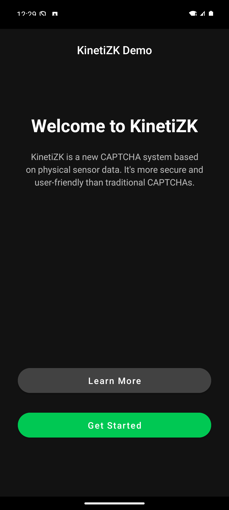
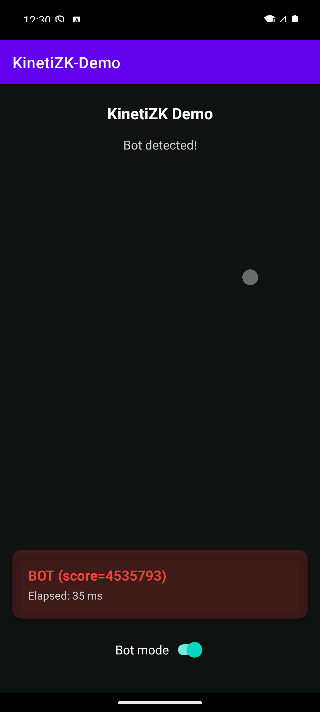

# KinetiZK Android Demo

This project is an Android demo application that implements a bot detection system inspired by the [zkSENSE paper](https://brave.com/blog/zksense-a-privacy-preserving-mechanism-for-bot-detection-in-mobile-devices/). It uses the KinetiZK Go SDK to analyze user touch behavior and distinguish between humans and bots using Zero-Knowledge Proofs.

The user's personal sensor data is never transmitted externally. Only a cryptographic proof of the fact that "the touch is not from a bot" is generated.

## Key Features

-   **Touch-based Sensor Data Collection**: Collects accelerometer and gyroscope data at the moment a touch occurs.
-   **On-Device ZKP Generation**: Generates a Zero-Knowledge Proof by calling the KinetiZK Go SDK based on the collected data.
-   **Real-time Classification**: Instantly verifies the generated proof to determine whether the user's touch was made by a human or a bot and displays the result.
-   **Bot Mode**: Simulates automated touch events to test how bot touches are detected.

## Screenshots

| Splash Screen | Main Screen (Human) | Main Screen (Bot) |
| :---: | :---: | :---: |
|  |  |  |

*(Screenshot images are included as examples in the `docs/` folder.)*

## Tech Stack & Libraries

-   **Language**: Kotlin
-   **Core Logic**: KinetiZK Go SDK (AAR library bound via gomobile)
-   **ZK-SNARK Proof System**: [gnark](https://github.com/Consensys/gnark)

## Project Structure

```
app/
├── libs/
│   └── kinetizk.aar            # KinetiZK Go SDK Library
├── src/
│   ├── main/
│   │   ├── assets/
│   │   │   └── kinetizk_keys.json  # ZKP Proving/Verifying Keys (Base64)
│   │   ├── java/com/example/kinetizk/demo/
│   │   │   ├── SplashActivity.kt   # App's launch screen
│   │   │   ├── MainActivity.kt     # Main logic and UI handling
│   │   │   ├── KinetiZKHelper.kt   # Wrapper class for the KinetiZK Go SDK
│   │   │   └── SensorCollector.kt  # Sensor data collection and management
│   │   ├── res/                    # Resources (layouts, colors, strings, etc.)
│   │   └── AndroidManifest.xml
└── build.gradle
```

### Core Class Descriptions

-   `MainActivity.kt`: Controls the overall flow of the app, including UI event handling, touch detection, and Bot Mode simulation.
-   `KinetiZKHelper.kt`: A singleton helper class that encapsulates interaction with the Go SDK. It is responsible for SDK initialization, passing sensor data, and requesting proof generation and verification.
-   `SensorCollector.kt`: Uses the Android Sensor Manager to collect accelerometer and gyroscope data, filtering it based on touch events.

## Getting Started

### Prerequisites

-   Android Studio (latest version recommended)
-   Android SDK (API 33 or higher)
-   `kinetizk.aar` file (KinetiZK Go SDK)
-   `kinetizk_keys.json` file (ZKP Proving/Verifying Keys)

### Build and Run

This project depends on the private KinetiZK Go SDK. To build it, you will need the pre-built SDK library and key files.

1.  **Add the AAR Library**:
    -   Place the provided `kinetizk.aar` file into the `app/libs/` directory of this Android project.

2.  **Add the Proving/Verifying Key File**:
    -   Place the provided `kinetizk_keys.json` file into the `app/src/main/assets/` directory of this Android project.

3.  **Build and Run the Project**:
    -   Open the project in Android Studio.
    -   Run `Sync Project with Gradle Files` to sync dependencies.
    -   Run the app on a connected Android device or emulator.

## How to Use

1.  Launch the app. After the splash screen, you will be taken to the main screen.
2.  Briefly tap (touch and release) the gray area on the screen.
3.  Sensor data is collected during the tap. The moment you lift your finger, ZKP proof generation and verification will begin.
4.  After a moment, the classification result ("HUMAN" or "BOT"), along with the score and processing time, will be displayed at the bottom of the screen.

### Testing with Bot Mode

-   Turn on the "Bot Mode" switch at the top of the screen. The app will start tapping the screen automatically.
-   Unlike a real touch, Bot Mode generates almost no change in sensor data, so it will almost always be classified as "BOT".
-   This allows you to see how KinetiZK distinguishes between physical and programmatic touches.

## References

-   **[zkSENSE: A Privacy-Preserving Mechanism for Bot-Detection in Mobile Devices](https://brave.com/blog/zksense-a-privacy-preserving-mechanism-for-bot-detection-in-mobile-devices/)**: The core concepts, SVM model, and feature extraction methodology for this project are derived from this research by Brave.
-   **[gnark](https://github.com/Consensys/gnark)**: The Zero-Knowledge Proof system is built using the powerful and efficient gnark library by Consensys.
-   **[gomobile](https://pkg.go.dev/golang.org/x/mobile/cmd/gomobile)**: The Go SDK is made available to Android through the gomobile tool.

## License

This project is distributed under the MIT License. See the `LICENSE` file for more information.