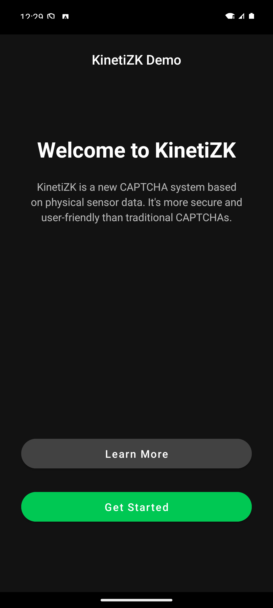
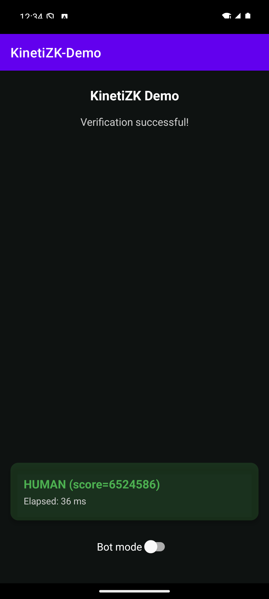
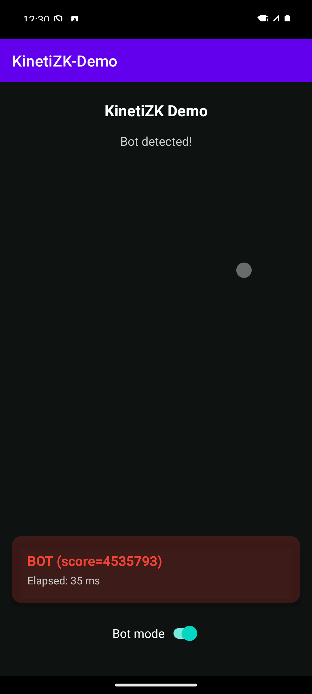

# KinetiZK Android Demo

This project is an Android demo application that implements a bot detection system inspired by the [zkSENSE paper](https://brave.com/blog/zksense-a-privacy-preserving-mechanism-for-bot-detection-in-mobile-devices/). It uses the KinetiZK Go SDK to analyze user touch behavior and distinguish between humans and bots using Zero-Knowledge Proofs.

The user's personal sensor data is never transmitted externally. Only a cryptographic proof of the fact that "the touch is not from a bot" is generated.

## Key Features

-   **Touch-based Sensor Data Collection**: Collects accelerometer and gyroscope data at the moment a touch occurs.
-   **On-Device ZKP Generation**: Generates a Zero-Knowledge Proof by calling the KinetiZK Go SDK based on the collected data.
-   **Real-time Classification**: Instantly verifies the generated proof to determine whether the user's touch was made by a human or a bot and displays the result.
-   **Bot Mode**: Simulates automated touch events to test how bot touches are detected.

## Screenshots

| Splash Screen | Main Screen (Human) | Main Screen (Bot) |
| :---: | :---: | :---: |
|  |  |  |

*(Screenshot images are included as examples in the `docs/` folder.)*

## Tech Stack & Libraries

-   **Language**: Kotlin
-   **Core Logic**: KinetiZK Go SDK (AAR library bound via gomobile)
-   **ZK-SNARK Proof System**: [gnark](https://github.com/Consensys/gnark)

## Technical Details

- **Sensors Used**: Linear accelerometer, gyroscope
- **Sampling Rate**: SENSOR_DELAY_FASTEST (~1000Hz)
- **Data Window**: 300ms total (-50ms before touch to +250ms after)
- **Feature Vector**: 48 dimensions (2 sensors × 4 statistics × 2 segments × 3 axes)
- **ML Model**: Support Vector Machine (SVM)
- **Proof System**: Groth16 zk-SNARKs on BN254 curve

## Requirements

- **Android 6.0+** (API level 23+)
- **Physical Device** with accelerometer and gyroscope sensors
- **Touch Capability** - the app needs actual finger touches to work properly

*Note: This demo will not work properly on emulators as they lack real sensor data.*

## Running the Demo

1. Install the APK on a physical Android device
2. Grant any requested permissions
3. Tap the screen to see verification in action
4. Try toggling "Bot Mode" to see the difference
5. Observe the real-time classification results

## Performance

- **Proof Generation**: ~300 milliseconds on modern devices
- **Classification**: Nearly instantaneous
- **Memory Usage**: ~20MB during operation
- **Battery Impact**: Minimal (sensors used only during verification)

---

## References

-   **[zkSENSE: A Privacy-Preserving Mechanism for Bot-Detection in Mobile Devices](https://brave.com/blog/zksense-a-privacy-preserving-mechanism-for-bot-detection-in-mobile-devices/)**: The core concepts, SVM model, and feature extraction methodology for this project are derived from this research by Brave.
-   **[gnark](https://github.com/Consensys/gnark)**: The Zero-Knowledge Proof system is built using the powerful and efficient gnark library by Consensys.
-   **[gomobile](https://pkg.go.dev/golang.org/x/mobile/cmd/gomobile)**: The Go SDK is made available to Android through the gomobile tool.

## License

This project is distributed under the MIT License. See the `LICENSE` file for more information.